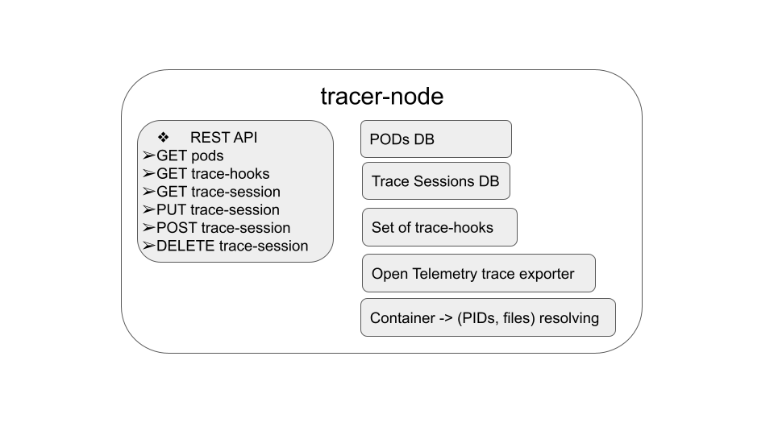

# tracer-node overview

## Architecture
The `tracer-node` module provides the main container-tracer functionality for containers tracing.
It has these main components:  
- A REST API, used to interact with the tracer on that node. Look at [REST API](container-tracer-api.md)
  for description of the API.  
- Logic for auto-discovery of all pods running on the node. Two different approaches are used
  for this auto-discovery:  
    - Using the CRI API. This is the preferred approach, when container-tracer runs in a Kubernetes context.  
    - Using the information from `/proc` file system on the host. If the CRI API is
    not available, this logic is used.  
- An in-memory database with all pods and containers running on the node. For each container,
  a list of PIDs is stored into the database, as seen in the host PID namespace.  
- A list of [trace-hooks](container-tracer-hooks.md), available in the `tracer-node`.  
- An in-memory database with configured trace sessions. A trace session is a set of containers,
  trace hook and trace parameters which has a state - running or stopped. When running, the trace
  hook is attached to the specified containers.  
- Open Telemetry trace exporters, used to export the output of running trace sessions to an
  external database.
## Parameters
On startup, `tracer-node` checks for specific environment variables and accepts these input arguments:  
- `--address` or `TRACER_API_ADDRESS`:  IP address and port in format IP:port, used for listening
   for incoming REST API requests. By default `:8080` is used.  
- `--node-name` or `TRACER_NODE_NAME`: Name of the node, which runs that `tracer-node` instance. Used
for logging purposes and is part of the traces collected on this node. There is no default value.  
- `--pod-name` or `TRACER_POD_NAME`: Name of this `tracer-node` pod, used to verify the correct
CRI endpoint.  
- `--cri-endpoint` or `TRACER_CRI_ENDPOINT`: A specific CRI endpoint that must be used for CRI API.
No default value, if it is not set - an auto discovery logic is used.  
- `--run-path` or `TRACER_RUN_PATHS`: Path to the run directories of the host, to look for cri endpoints.
By default `/run` and `/var/run` are used, but usually when running in a container, the host run paths
are mounted on custom places. These are used to auto discover the endpoint of the CRI API, if no
specific CRI endpoint is specified. 
- `--procfs-path` or `TRACER_PROCFS_PATH`: Path to the mount point of `/proc` file system of the host.
By default it is `/proc`, but usually when running in a container the host `/proc` is mounted on
a custom path. 
- `--sysfs-path` or `TRACER_SYSFS_PATH`: Path to the mount point of `/sys` file system of the host.
By default it is `/sys`, but usually when running in a container, the host `/sys` is mounted on
a custom path.  
- `--use-procfs` or `TRACER_FORCE_PROCFS`: Force using `/proc` of the host for auto-discovery
the containers, running on the local node. Not set by default. The default logic is to use
the CRI API if available. If CRI API is not accessible, fail back to logic that gets this
information from `/proc`.  
- `--jaeger-endpoint` or `TRACER_JEAGER_ENDPOINT`: URL of the jaeger endpoint service, used to send
the collected traces. Can be set to `auto`, which triggers the defaul logic - search for
`jaeger-collector` service that exposes port `14268` and use `http://jaeger-collector:14268/api/traces`
as an endpoint to jaeger.  
- `--verbose` or `TRACE_KUBE_VERBOSE`: Dump more detailed logs, disabled by default.  
If both input argument and environment variable for a same setting exist, only the input argument is taken.