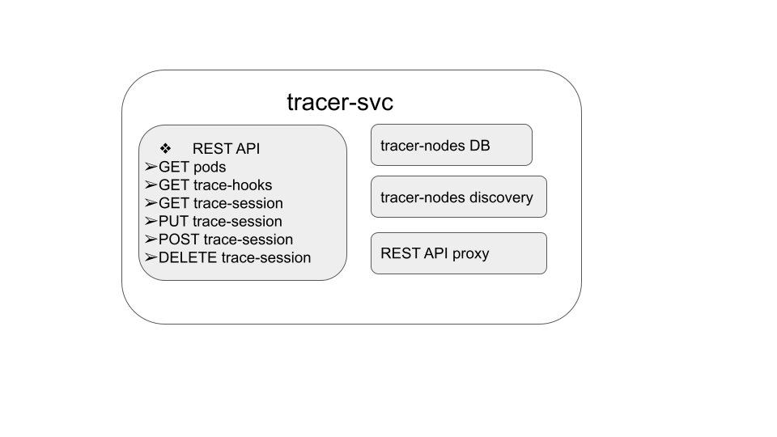

# tracer-svc overview

## Architecture
The `tracer-svc` module is a proxy service, used to expose the REST API when the container-tracer
runs in a Kubernetes context. It has the following main components:  
- A REST API, that is used to interact with all `tracer-node` modules in the cluster. Look at
  [REST API](container-tracer-api.md) for a description of the API.  
- An in-memory database with all `tracer-node` pods in the cluster.  
- Logic for auto-discovery of `tracer-node` pods in the cluster. It runs periodically in
  the background, detects any changes and updates the database.  
- A broadcast proxy logic, which is responsible for sending a received API request to all
  `tracer-node` pods, receiving and aggregating the responses and sending back the reply
  to the caller.
## Parameters
On startup, `tracer-svc` checks for specific environment variables and accepts these input arguments:  
- `--address` or `TRACE_KUBE_API_ADDRESS`:  IP address and port in format IP:port, used to listen
   for incoming REST API requests. By default `:8080` is used.  
- `--poll` or `TRACE_KUBE_DISCOVERY_POLL`:  Polling interval for `tracer-node` discovery, in seconds. By default,
  the discovery logic is triggered on every 10 seconds.  
- `--pods-selector` or `TRACE_KUBE_SELECTOR_PODS`: Label selector for filtering `tracer-node` pods. By default
  `app=container-tracer-backend` is used. This label is used in the auto-discovery logic.  
- `--svc-selector` or `TRACE_KUBE_SELECTOR_SVCS`: Field selector for filtering `tracer-node` service. By default
  `metadata.name=container-tracer-node` is used. This selector is used in the auto-discovery logic.  
- `--verbose` or `TRACE_KUBE_VERBOSE`: Dump more detailed logs, disabled by default.  

If both input argument and environment variable for a same setting exist, only the input argument is taken.